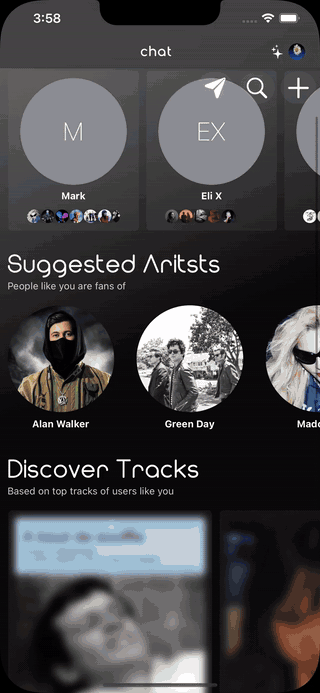

# Chat for Spotify

An iOS social app I designed, developed, and released in 2023. It used Spotify listening data to help people find others with similar music taste, explore music, and chat directly or in groups.

  
  

## Overview

- Spotify OAuth with automatic token refresh, plus Web API clients for profiles, top artists and tracks, recommendations, saved tracks, and following users.
- OpenAI embeddings generated from each user's top artists, tracks, recent listening, and genres, with Pinecone similarity search used to find matching profiles.
- Spotify identities linked to Firebase Authentication through custom tokens. Realtime Database, Storage, and Cloud Functions supported profiles, direct and group chat, presence, invitations, unread messages, reporting, and moderation.
- StoreKit premium access with verified transactions linked to each user account and refresh limits stored in Firebase.
- SwiftUI interface with UIKit where needed and AVKit for track preview playback.

## Stack

Swift · SwiftUI · UIKit · AVKit · StoreKit · Spotify Web API · Firebase Authentication · Realtime Database · Storage · Cloud Functions · OpenAI API · Pinecone
